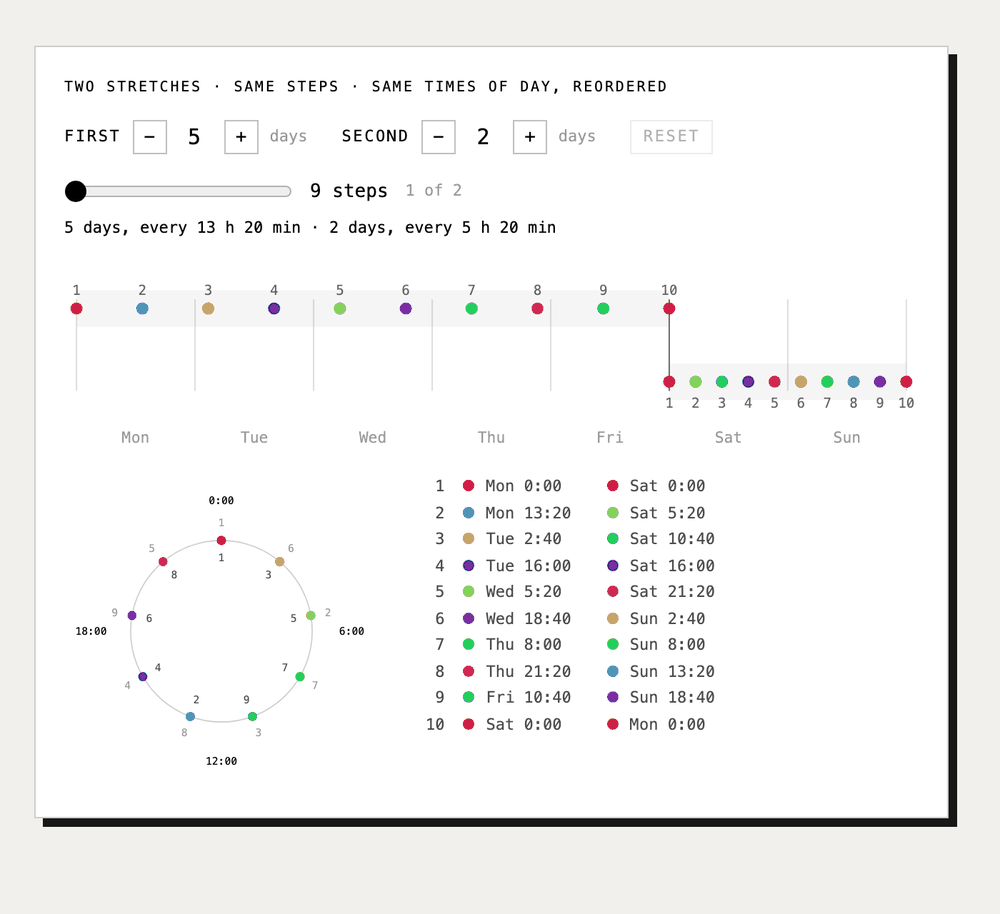

# Daybreak



Daybreak takes two time periods and computes a time-step that splits them into rearrangeably similar sequences: the same clock times, in a different order.

Try it on [mattabate.com/projects](https://mattabate.com/projects). It accompanies Puzzle Poetry, my article in [The Journal of Wordplay, Issue #5](https://www.journalofwordplay.com/TJoW5.pdf#page=32).

## Usage

```bash
python main.py --days [5,2] --verbose False
```

Replace `[5,2]` with your desired number of days and `False` with your desired verbosity setting.

## Dependencies

This script uses the `fire` library for command line interfaces:

```bash
pip3 install fire
```
